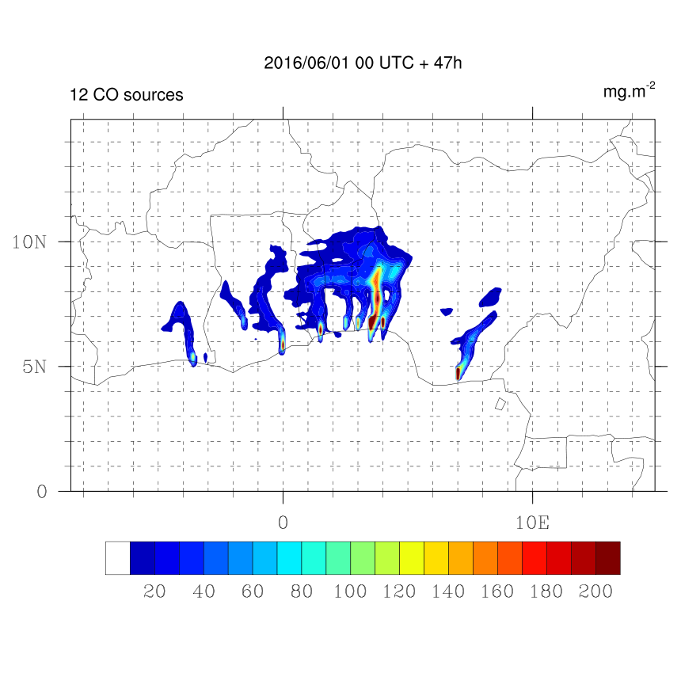

# GIRAFE

GIRAFE - reGIonal ReAl time Fire plumEs

GIRAFE is a software that provides plume trajectory forecasts. The trajectories are calculated using the Lagrangian transport model FLEXPART and the ECMWF meteorological fields.

<p align="center">
    
</p>

## Requirements
The GIRAFE tool is containerized into a Singularity container so one must have Singularity installed on the host system intended for simulations.

## Installation
```
git clone https://github.com/aeris-data/girafe.git
sudo singularity build ./girafe-image.sif ./girafe-container.def
```

The `singularity build` command will build the container `girafe-image.sif` from its definition file, using the source files got from the git repo; so for the build it is important to call the command from the git repo directory that one has made. 

⚠️ ***The build requires either sudo rights or being able to use `--fakeroot` option (in a case of a multi-user server).***

Afterwards, the sif image can be placed anywhere (even on another system) independently of the source files. To run the image no sudo rights are required.

## Usage
The main script is `girafe.py` which needs the input configuration file `user-config.xml` (which can be renamed, the name is not important). The Python script handles the launch combinations, writes input files for the FLEXPART executable and post-process simulation results. The main usage is
```
$ python3 girafe.py --config user-config.xml
```

⚠️ ***The script must be launched inside the Singularity container.***

The outputs of the simulation are : plume estimated trajectories in the binary or netCDF format (based on your configuration) + PNG map plot of the estimated trajectories. More details about input/output and folder structure are in the manual.

There are two possible ways to launch the simulation inside the Singularity container:
- one-line command (run a command within a container, wait for the end of simulation to regain control of the shell)
```
$ singularity exec [--bind path1,path2] girafe-image.sif python3 girafe.py --config user-config.xml
```
- interactive mode (run a shell within a container, then launch the command within the shell of the container)
```
$ singularity shell [--bind path1,path2] girafes-image.sif
Singularity>
Singularity> python3 girafe.py --config user-config.xml
```

### Bind option

The `--bind` option allows to map directories on the host system to directories within the container. Most of the time, this option allows to solve the error *"File (or directory) not found"*, when all of the paths are configured correctly but the error persists. Here is why it can happen. When Singularity ‘swaps’ the host operating system for the one inside your container, the host file systems becomes partially inaccessible. The system administrator has the ability to define what bind paths will be included automatically inside each container. Some bind paths are automatically derived (e.g. a user’s home directory) and some are statically defined (e.g. bind paths in the Singularity configuration file). In the default configuration, the directories $HOME , /tmp , /proc , /sys , /dev, and $PWD are among the system-defined bind paths. Thus, in order to read and/or write files on the host system from within the container, one must to bind the necessary directories if they are not automatically included. Here’s an example of using the `--bind` option and binding `/data` on the host to `/mnt` in the container (`/mnt` does not need to already exist in the container):

```
$ ls /data
bar  foo

$ singularity exec --bind /data:/mnt my_container.sif ls /mnt
bar  foo
```

You can bind multiple directories in a single command with this syntax:

```
$ singularity shell --bind /opt,/data:/mnt my_container.sif
```

This will bind `/opt` on the host to `/opt` in the container and `/data` on the host to `/mnt` in the container.

## Input meteorological data extraction
The input data for the simulations is meteorological data coming from the ECMWF database. To extract and prepare the data in the correct format, the `flex_extract` tool should be used. The flex_extract app must be installed on your MARS server (ecs, hpc or other); the detailed installation guide can be found in the GIRAFE manual ```diff - text in red```. An overlay Bash script was created to facilitate the data extraction and simulation launch with flex_extract for the GIRAFE specific study case. This script allows to combine the data extraction performed on the MARS server and the simulation launch on a remote server defined by the user (where the GIRAFE tool itself is installed). The main usage of this overlay script is :
```
$ ./girafe-extract-ecmwf.sh --config girafe_extraction.conf
```
where the `girafe_extraction.conf` is the configuration file with necessary parameters set by the user. This script will first handle the data extraction using flex_extract based on the simulation parameters set by the user; if the extraction was successful, the script will then transfer the data to a remote server defined by the user; if the parameter `LAUNCH_SIMULATION` in the configuration file was set to `true`, the simulation will then be launched remotely by the overlay script. If `LAUNCH_SIMULATION=false`, no simulation will be performed, only the data extraction will be done. If the remote server information is not provided, the data won't be transferred and could be found in the MARS output directory defined by the user.
